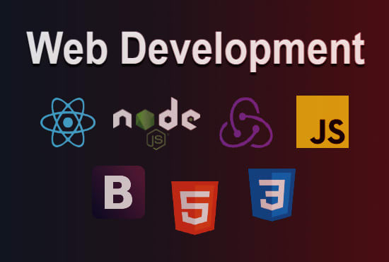

<h1 align="center">Hi 👋, I'm Daniel Barbieri</h1>
<h3 align="center">Full Stack Developer</h3>

<h3 align="left">Languages and Tools:</h3>
 

  

    
     
    HTML5
  

  

    
     
    CSS3
  

  

    
     
    JavaScript
  

  

    
     
    React.js
  

  

    
     
    Redux.js
  

  

    
     
    NodeJS
  

  

    
     
    C++
  

 
 

  

    
     
    Express
  

  

    
     
    git
  

  

    
     
    PostgreSQL
  

  

    
     
    Python
  

  

    
     
    Sequelize
  

&nbsp;

<h3 align="left">Connect with me:</h3>

